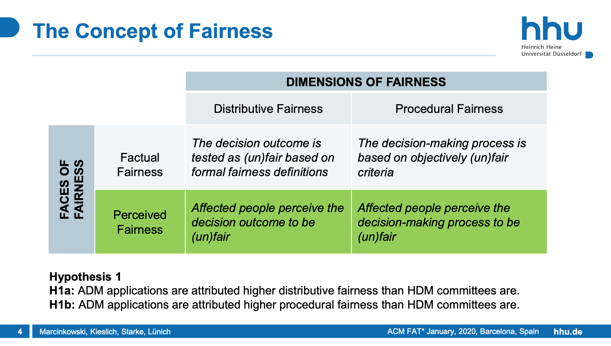

# Auditing/Assessment 1: Implications of AI (Un-)Fairness in Higher Education Admissions

| Item | Description |
| --- | --- | 
| Presented By | Frank Marcinkowski |
| Paper | [Implications of AI (Un-)Fairness in Higher Education Admissions](https://dl.acm.org/doi/pdf/10.1145/3351095.3372867?download=true) |

## Notes

Implications of AI (Un-)Fairness in Higher Education Admissions: The Effects of Perceived AI (Un-)Fairness on Exit, Voice and Organizational Reputation

- Fairness Dimensions
    - distributed: the outcome of a process
    - procedural: focuses on the process
- Faces of Fairness
    - factual: how it aligns to the formal definition used
    - perceived: how it's perceieved
- Found that:
    - automated decision making (ADM) is percieved as fairer for both distribution & procedural fairness
        - Warning comes with this to ensure proper implementations
    - Procedural fairness perceptions have a negative effect on speaking out
