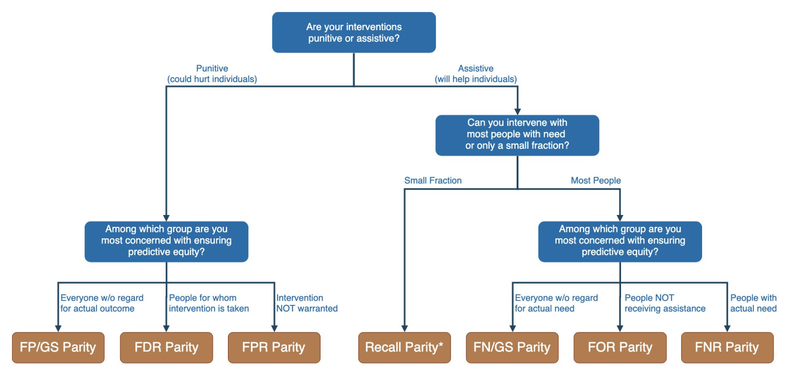

# Auditing/Assessment 1: Case Study: Predictive Fairness to Reduce Misdemeanor Recidivism Through Social Service Interventions

| Item | Description |
| --- | --- | 
| Presented By | Kit T. Rodolfa |
| Paper | [Case Study: Predictive Fairness to Reduce Misdemeanor Recidivism Through Social Service Interventions](https://dl.acm.org/doi/pdf/10.1145/3351095.3372863?download=true) |
| Github | [Data Science for Social Good](www.github.com/dssg)

## Notes

- Tradeoffs exist when fitting to your fairness measure, eg:
    - Equalise recall
    - Equity vs Efficiency

- Built a model to identify the 150 highest risk individuals when it came to recidivism then wanted to refactor it to equalise recall across ethnicity
- Options to resolve could be:
    - expand program to equalise results (collect more data)
