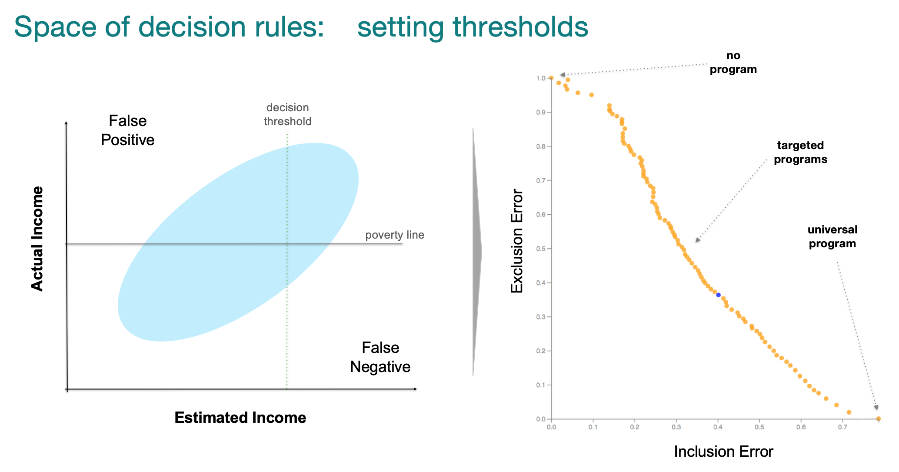

# Ethics & Policy: Algorithmic Targeting of Social Policies: Fairness, Accuracy, and Distributed Governance

| Item | Description |
| --- | --- | 
| Presented By | Elettra Bietti |
| Paper | [Algorithmic Targeting of Social Policies: Fairness, Accuracy, and Distributed Governance](https://dl.acm.org/doi/pdf/10.1145/3351095.3375784?download=true) |

## Notes

- Social policies:
    - Universal
    - Targeted: Specific actions for a section of the population (the poor, a race, etc)
- Issues arrive in targeted systems when errors creep in
- Using only actuals introduces risk as it's dependent on the quality of data
    - A possible solution is to combine it with an estimated equivalent
- A trade-off exists between over or under allocating (using more or less of the estimated value)

- Developed a platform that allow institutes to test out relationships between actual vs estimated as well as their respective definitions of fairness