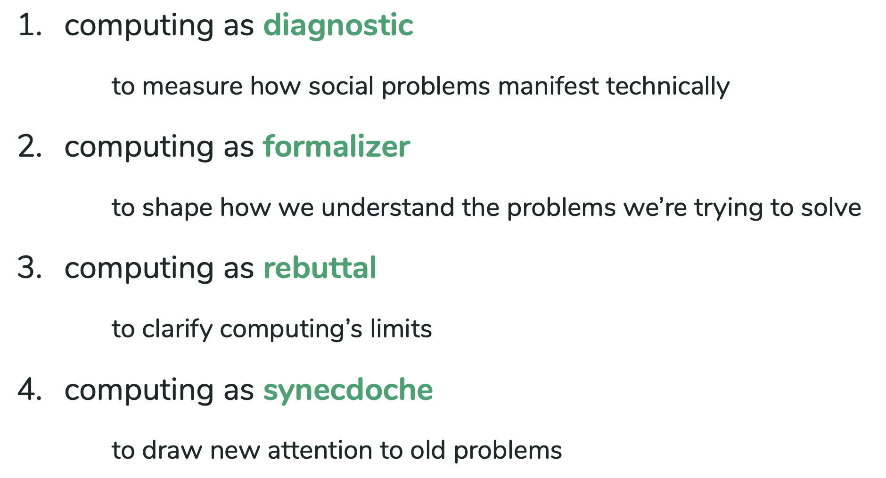

# Ethics & Policy: Roles for Computing in Social Change

| Item | Description |
| --- | --- | 
| Presented By | Rediet Abebe |
| Paper | [Roles for Computing in Social Change](https://dl.acm.org/doi/pdf/10.1145/3351095.3372871?download=true) |

## Notes

Proposes a framing for how computing (FAT* ) can contribute to social good problems

- Computing as a **diagnostic**:
    - computing can assist with measurement of bias
- Computing as a **foraliser**:
    - Models force assumptions & thoughts into formal definitions
    - Can shape how social problems are understood
    - This formalisation runs risks when not transperent
- Computing as a **rebuttal**:
    - Computing can highlight where technical limitations exist & where alternate approaches/solutions are required
- Computing as **synecdoche**:
    - Computing can foreground long-standing social problems in a new way
    - Can force us to reconceptualise & bring new attention to problems
    - Book to read: *"Automating inequality"*

