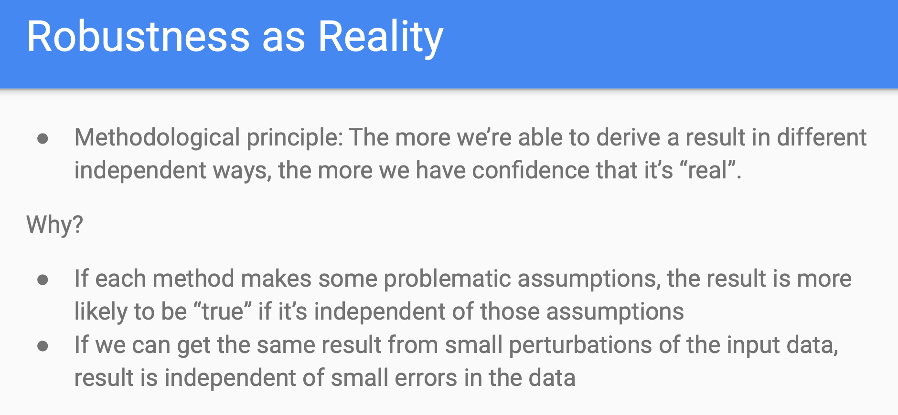

# Explainability: Robustness in Machine Learning Explanations:Does it Matter?

| Item | Description |
| --- | --- | 
| Presented By | Leif Hancox-Li |
| Paper | [Robustness in Machine Learning Explanations: Does It Matter?](https://dl.acm.org/doi/pdf/10.1145/3351095.3372836?download=true) |

## Notes

- Contend if we're going to explore ML explanations then those explanations should be robust
    - Helps us avoid moral hazard & a truer view of the world

- *Robustness*:
    - The more we can derive a result in multiple, independent ways, the more we have confidence that it's "real"
- LIME & SHAP are not robust as you can perturb the input data such that the predictions are unchanged but the explanations are. Additionally, different models can perform equally well but produce considerably different explanations
- Often explanations are used as justifications for decision making
- Contends robust explanations matter ethical & epistemic reasons
