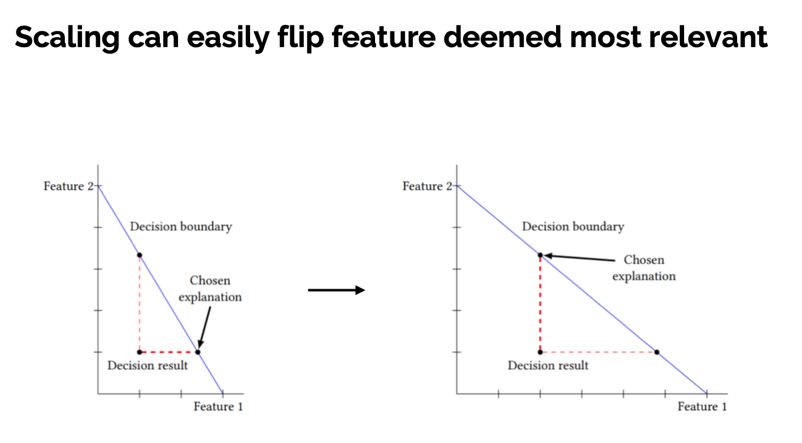

# Explainability: The Hidden Assumptions Behind Counterfactual Explanations and Principal Reasons

| Item | Description |
| --- | --- | 
| Presented By | Andrew D. Selbst |
| Paper | [The Hidden Assumptions Behind Counterfactual Explanations and Principal Reasons](https://dl.acm.org/doi/pdf/10.1145/3351095.3372830?download=true) |

## Notes

3 challenges/Assumptions with counterfactuals:
- Change in feature values map not map to real-world values
    - Not always possible to move features in a certain way, eg increase age by 10years
    - Comment: Ideally should combine with prototypes
- Features cannot be made commensurate by looking only at the ditribution of the training data
    - Feature scale can impact the importance it has when generating the model & counterfactuals
- Features may be relevant to more than the decision at hand
    - Need to consider how rational the recommendation coming from the counterfactual is beyond just the scope of the model/problem. These could have impacts outside of this domain & thus may be more broadly counter productive

3 Tensions:
- Feature-highlighting explainations compromise
- feature highlights explanations grant decision makers a remarkable degree of power
- making explanations use ful will eventually conflict with the need or desire to keep the model hidden

