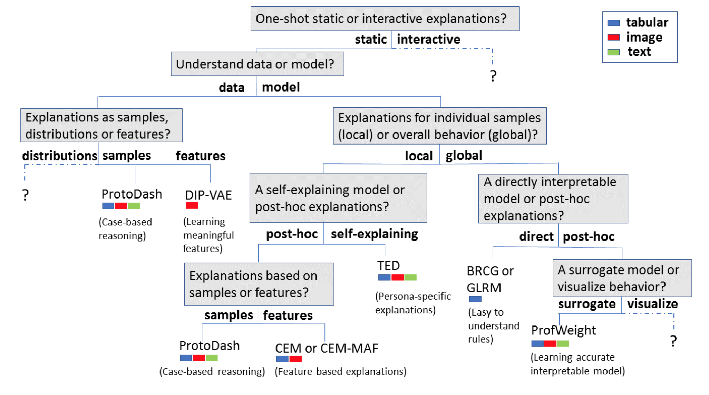

# AI Explainability 360

| Item | Description |
| --- | --- | 
| Presented By | IBM Research |
| FAT Reference | [AI Explainability 360 Tutorial](https://fatconference.org/2020/acceptedtuts.html#ai) |
| Paper | [AI explainability 360: hands-on tutorial](https://dl.acm.org/doi/abs/10.1145/3351095.3375667) |
| Microsite | [AI Explainability 360 Tutorial](https://github.com/IBM/AIX360/wiki/ACM-FAT*2020-Tutorial) |
| Github | [IBM/AIX360](https://github.com/IBM/AIX360) |
| Website | [Bluemix Demos](http://aix360.mybluemix.net/) |

## Notes

### General Interpretability Metrics

- Maximum mean discrepancy critic
- Saliency maps
    - Image explainability
    - Aims to highlight the objects that determined the classification
    - Works by identifying how much the classification changes based on different components in the image
- Knowledge Distilation

### AI 360 Intro

- Developed by IBM
    - As such some of the functionality is available open source but in order to create a "value proposition" many useful features are excluded & only available for purchase, eg categorical variables, feature filtering for counterfactuals, etc
- Developed a taxonomy that can be explored to identify the most appropriate technique
    

- Types:
    - *post-hoc*: explain each point/observation etc
    - *self-explaining*: The model to derive the explanations might not be explainable
- Key idea of the approach is to provide insight to the various people that interact with a model & it's outputs & aligns with their knowledge & skillset
    - Data Scientist Persona:
        - Potential Explanation Type: Interpretable models, eg rule-based
        - Focused on understanding the in's & out's of the model, it's accuracy & how it works
    - Business User Persona: 
        - Potential Explanation Type: ProtoDash
        - Aiming to build trust by comparing with historical data/cases
    - Customer Persona:
        - Potential Explanation Type: Contrastive Explanation (CEN)
        - Highlight areas that directed the decision &/or areas they could change to alter the decision

### Package Walkthrough

**Use-case**: *whether or not a financial institute should offer a loan to a loan applicant*

The demo is available online but behind a login.

- Alogorithm Proto-Dash:
    - Retrieves/identifies similar observations (aka `prototypes`) to the one of interest
        - [Maximum mean discrepency](https://www.ibm.com/blogs/research/2019/10/learning-implicit-generative-models/) used as the similarity metric
        - Highlights the most similar items
    

Not all algoirthms are available yet in the package. Some of the handling for categorical variables are currently closed source but the accompanying papers should be available.

### Demos

#### HELOC

Whether or not to approve a loan application.

- [Credit Approval Tutorial](https://nbviewer.jupyter.org/github/IBM/AIX360/blob/master/examples/tutorials/HELOC.ipynb)

Provides an example of supervised prototype identification based on model outputs.

*NOTE: In order to run the demo the data is required from FICO & requires submitting an access request*

#### CDC

Data investigation of survey data

- [Protodash: NHANES (CDC)](https://nbviewer.jupyter.org/github/IBM/AIX360/blob/master/examples/protodash/Protodash-CDC.ipynb) 

Provides an unsupervised example of prototype identification that doesn't require a model. Can be used (as in the demo) as a data exploratory tool.

Can modify the distance metric to ensure prototypes generated represent particular attributes, eg gender or race coverage. Similar concepts are covered in the paper [Fair Clustering Through Fairlets](https://papers.nips.cc/paper/7088-fair-clustering-through-fairlets.pdf)

#### Dermoscopy

Identification of skin conditions (cancer, etc) through dermoscopic images. 

- [Skin Lesion Classification using Dermoscopic Images](https://nbviewer.jupyter.org/github/IBM/AIX360/blob/master/examples/tutorials/dermoscopy.ipynb)

Explainer approach is called DIP-VAE or Disentangled Inferred Prior Variational Autoencoder. Based off the following papers:
- [Variational Inference of Disentangled Latent Concepts from Unlabeled Observations](https://arxiv.org/abs/1711.00848)
- [Auto-encoding variational Bayes](https://arxiv.org/pdf/1312.6114.pdf)

The focus is on explaining images, with the concept surrounding permutations of the latent representation to understand how the output image changes.
1. Train an autoencoder:
    - original image -> Latent features (of length N) + loss -> "predicted" image that is an exact match
        - Where loss = reconstruction loss + regulariser
    - The latent features are representative of the different attributes identified in the model. In addition to human input these can be labelled/associated with known "physical" items, similar to labelling clusters
    - Length N refers to each attribute learned
2. Modification of the latent feature values can highlight how the model reacts to different attribute changes
3. Alternatively the latent features can be used to build a simple model & used as the features. This model in addition to existing explainability tools (LIME/SHAP/etc) can be used to explain more complicated NN/DL style models

### Comments on the library
- Supports both continuous & categorical features (as well as combinations of both)
    - Eg a continuous feature plus a binned version
- Supports a custom method for binarising data prior to analysis
    - `FeatureBinarizer` to manage this with options such as bin size
- LRR: Logistic Rule Regression
    - Generates a GAM
